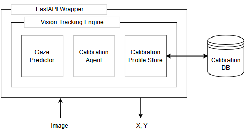

# Vision Tracking Service

An ML-Powered Gaze tracking and point of regard estimation tool wrapped in a FastAPI-based web-server.

### High-Level Architecture and Key Components

**Vision Tracking Engine:** The central orchestration object leveraging composition of the three other key component to manage calibration profiles and predict point of regard.

**Gaze Predictor:** A wrapper around the L2CSNet model which, given an image, returns a prediction for the Gaze Vector of the person in the picture, along with coordinates of their eyes.

**Calibration Agent:** Runs interpolation to predict the Point of Regard, given a Gaze vector by leveraging pre-recorded calibration points.

**Calibration Profile Store:** An SQLAlchemy-based database handler to store and retrieve Calibration Profiles.
